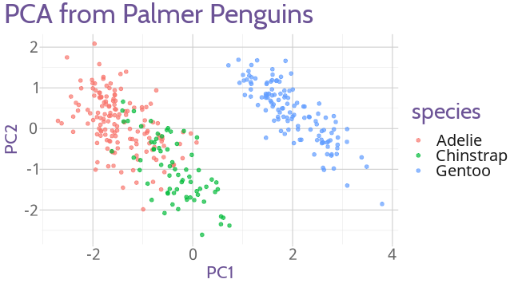
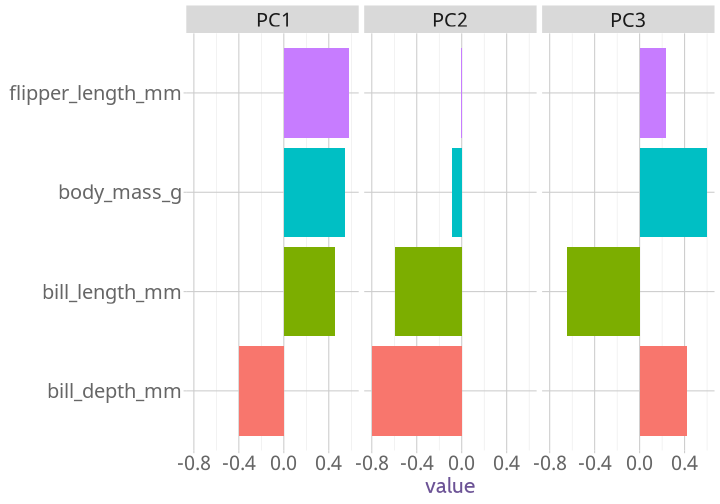

---
output:
  xaringan::moon_reader:
    lib_dir: libs
    css: xaringan-themer.css
    nature:
      highlightStyle: github
      highlightLines: true
      countIncrementalSlides: false
---

background-image: url(img/portada.png)
background-size: cover
class: animated slideInRight fadeOutLeft, middle


<!--html_preserve--><style type="text/css">
.xaringan-extra-logo {
  width: 110px;
  height: 128px;
  z-index: 0;
  background-image: url('img/logo-tidymodels.png');
  background-size: contain;
  background-repeat: no-repeat;
  position: absolute;
  top:1em;right:1em;
}
</style><!--/html_preserve-->


# Análisis No Supervisado


### 1º Congreso Latinoamericano de Mujeres en Bioinformática y Ciencia de Datos


---
background-image: url(img/penguin-fondo.png)
background-size: cover


## Análisis de Componentes Principales


```r
library(tidymodels)
library(tidyverse)
penguins <- palmerpenguins::penguins 
# la variable cualitativa es species
penguins <- penguins %>%
  select(-sex, -year, -island)%>%
  drop_na()
library(recipes)
```


.footnote[https://juliasilge.com/blog/cocktail-recipes-umap/]
---


```r
pca_rec <- recipe(~., data = penguins) %>%
  update_role(species, new_role = "id") %>%
  step_normalize(all_predictors()) %>%
  step_pca(all_predictors())

pca_prep <- prep(pca_rec)

pca_prep
```

```
## Data Recipe
## 
## Inputs:
## 
##       role #variables
##         id          1
##  predictor          4
## 
## Training data contained 342 data points and no missing data.
## 
## Operations:
## 
## Centering and scaling for bill_length_mm, ... [trained]
## PCA extraction with bill_length_mm, bill_depth_mm, ... [trained]
```


---
background-image: url(img/penguin-fondo.png)
background-size: cover


```r
juice(pca_prep) %>%
  ggplot(aes(PC1, PC2, label = species)) +
  geom_point(aes(color = species), alpha = 0.7, size = 2) +
  labs(title="PCA from Palmer Penguins")+
  theme_xaringan()
```

<!-- -->


---

background-image: url(img/penguin-fondo.png)
background-size: cover


```r
tidied_pca <- tidy(pca_prep, 2)

tidied_pca %>%
  filter(component %in% paste0("PC", 1:3)) %>%
  mutate(component = fct_inorder(component)) %>%
  ggplot(aes(value, terms, fill = terms)) +
  geom_col(show.legend = FALSE) +
  facet_wrap(~component, nrow = 1) +
  labs(y = NULL)+
  theme_xaringan()
```

---
background-image: url(img/penguin-fondo.png)
background-size: cover 


<!-- -->


---
background-image: url(img/penguin-fondo.png)
background-size: cover

# Ejercicio


.bg-near-white.b--purple.ba.bw2.br3.shadow-5.ph4.mt5[
#### Realice un gráfico de PCA del set de datos iris siguiendo los mismos pasos

]

<!--html_preserve--><div class="countdown" id="timer_5f6ac4c9" style="right:0;bottom:0;" data-warnwhen="0">
<code class="countdown-time"><span class="countdown-digits minutes">05</span><span class="countdown-digits colon">:</span><span class="countdown-digits seconds">00</span></code>
</div><!--/html_preserve-->

---

background-image: url(img/.png)
background-size: cover
